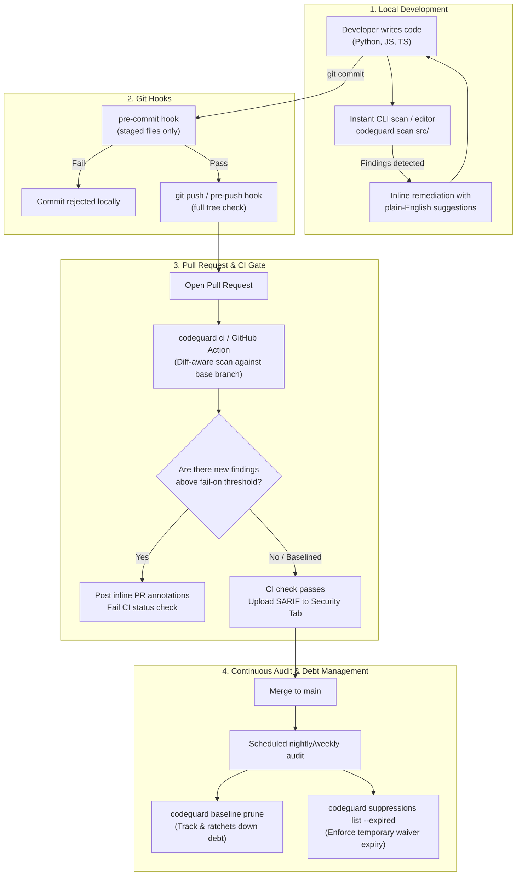

# CodeGuard Product & Workflow Guide

> **Fast, offline, zero-infrastructure static security analysis for modern engineering teams.**  
> Native support for **Python, JavaScript, and TypeScript** with single-configuration governance across your entire SDLC.

---

## 1. Executive Summary & Product Vision

**CodeGuard** is a fast, developer-friendly static application security testing (SAST) tool engineered to eliminate security anti-patterns *before* code reaches production. 

Following its **v2.0 makeover**, CodeGuard bridges the gap between lightweight linters and heavy enterprise SAST suites. It requires **no server infrastructure, no database, no Docker daemon, and zero cloud API keys**. Everything runs 100% offline, executing deterministic AST and Tree-sitter semantic analysis in milliseconds.

```
       ┌────────────────────────────────────────────────────────────────────────┐
       │                             CodeGuard                                  │
       │   Fast • 100% Offline • Zero Noise • Unified Policy Across All Gates   │
       └───────────────────────────────────┬────────────────────────────────────┘
                                           │
         ┌───────────────────┬─────────────┴───────┬────────────────────┐
         ▼                   ▼                     ▼                    ▼
   [Local Editor]      [Pre-Commit]          [PR / CI Gate]      [Audit & Baseline]
   Sub-second scan     Block bad code        Diff-aware PR       Manage tech debt &
   while coding        before commit         checks & SARIF      track suppressions
```

---

## 2. Where CodeGuard Fits in Your Development Workflow

CodeGuard is designed around a **multi-gated security model**, ensuring that security validation happens continuously throughout the developer workflow rather than as a delayed gate at release time.



---

### The 5 Gates of CodeGuard

| Gate | Stage | Trigger / Command | User Experience & Outcome |
| :--- | :--- | :--- | :--- |
| **Gate 1: Inner Loop** | Local Dev & IDE | `codeguard scan <path>` | Developers get sub-second feedback in their terminal with exact line numbers, code carets, and direct remediation snippets. |
| **Gate 2: Pre-Commit** | Git Commit | `pre-commit` hook (`id: codeguard`) | Catches mistakes before they are committed to git history; scans only modified files in milliseconds. |
| **Gate 3: Pull Request** | CI Pipeline | `codeguard ci` or GitHub Action | Scans **only changed files/lines** against the PR base branch. Baselined legacy issues are ignored; only **newly introduced vulnerabilities** fail the build. |
| **Gate 4: Platform Security** | Code Scanning Dashboard | `--format sarif` | Feeds directly into GitHub Code Scanning, GitLab Security Dashboard, Reviewdog, or JUnit test reporters. |
| **Gate 5: Governance & Audit** | Scheduled CI / Maintenance | `codeguard baseline prune`<br>`codeguard suppressions list` | Ensures technical debt is reduced over time and temporary waivers (`until=YYYY-MM-DD`) cannot be silently forgotten. |

---

## 3. How CodeGuard Creates Value

### 1. Shift-Left Without Developer Friction
* **The Problem:** Traditional enterprise SAST tools take 15–45 minutes to run in CI, spit out hundreds of false positives, and deliver reports to security teams weeks after the code was written.
* **The CodeGuard Solution:** CodeGuard runs in **< 100 milliseconds** locally or in CI. It gives developers immediate, deterministic feedback directly in their terminal and PR diffs, with concrete code fixes.

### 2. "Stop the Bleeding" Baseline Adoption (Zero Day-1 Friction)
* **The Problem:** Adding a new security tool to a legacy codebase often creates 500+ immediate alerts, causing teams to abandon the tool or disable rules.
* **The CodeGuard Solution:** Run `codeguard baseline create`. CodeGuard fingerprints existing issues and stores them in `.codeguard-baseline.json`. From that moment on, CI will **never break on existing legacy code**—it only blocks *new* vulnerabilities introduced in active PRs. Teams can then prune debt incrementally.

### 3. Governed, Accountable Suppressions (No Rotting Waivers)
* **The Problem:** Developers routinely bypass linter/security warnings with `# noqa` or `# ignore` comments without justification, creating permanent blind spots.
* **The CodeGuard Solution:** 
  * Every suppression requires an explicit reason:  
    `# codeguard: ignore[CG-SEC-001] reason: sanitized by custom validator`  
    *(Omitting a reason raises rule `CG-META-001`).*
  * Suppressions can carry expiration dates: `until=2026-12-31`.  
    *(Once expired, the finding reactivates and raises `CG-META-002`).*
  * Security leads can audit all waivers with `codeguard suppressions list`.

### 4. 100% Offline, Privacy-First Architecture
* No source code is ever sent over the internet or passed to an external LLM endpoint.
* Ideal for air-gapped environments, strict compliance regimes (HIPAA, SOC2, FedRAMP, ISO 27001), and IP-sensitive proprietary codebases.

### 5. Predictable CI Contracts & Multi-Ecosystem Formats
* Built with strict semantic exit codes (`0` clean, `1` findings, `2` usage error, `3` config error, `4` internal error).
* First-class formatters for any pipeline: `human`, `json` (v1 schema envelope), `sarif` (OASIS 2.1.0), `github` (Actions workflow commands), `rdjson` (Reviewdog), and `junit` (CI test runners).

---

## 4. Current Feature Catalog (v2.0)

### 4.1 Multi-Language Engine
CodeGuard features a unified analysis pipeline supporting:
* **Python**: Standard AST analysis across `.py` and `.pyi` files.
* **JavaScript & TypeScript**: High-performance Tree-sitter semantic tree analysis supporting `.js`, `.jsx`, `.mjs`, `.cjs`, `.ts`, `.tsx`, `.mts`, and `.cts`.
* **Smart File Discovery**: Automatically respects `.gitignore`, skips vendor/build artifacts (`node_modules/`, `.venv/`, `dist/`, `__pycache__/`), and ignores minified assets (`*.min.js`, `*.d.ts`).
* **Multi-Core Parallelism**: Built-in worker process pool (`--jobs / -j`) for multi-core scanning across large repositories.

---

### 4.2 Security & Meta Rules

Every rule in CodeGuard has a permanent ID, standardized severity, CWE/OWASP classification, and actionable remediation guide:

```
┌─────────────┬────────────────────────────────────────────────────────┬──────────┬───────────┬────────────┐
│ Rule ID     │ Description                                            │ Severity │ CWE / Ref │ Languages  │
├─────────────┼────────────────────────────────────────────────────────┼──────────┼───────────┼────────────┤
│ CG-SEC-001  │ SQL query constructed via f-strings, %, or .format()  │ HIGH     │ CWE-89    │ Python     │
│ CG-SEC-002  │ Hardcoded passwords, API keys, tokens, or credentials  │ HIGH     │ CWE-798   │ Python     │
│ CG-SEC-003  │ eval() or exec() execution on dynamic/non-literal input│ HIGH     │ CWE-95    │ Python     │
│ CG-SEC-004  │ Unsafe deserialization (pickle.loads, yaml.load)       │ HIGH     │ CWE-502   │ Python     │
│ CG-SEC-005  │ subprocess() invoked with shell=True on dynamic args   │ HIGH     │ CWE-78    │ Python     │
│ CG-SEC-101  │ Dynamic evaluation: eval(), new Function, string timer │ HIGH     │ CWE-95    │ JS, TS     │
│ CG-SEC-102  │ child_process.exec() invoked with a dynamic command    │ HIGH     │ CWE-78    │ JS, TS     │
│ CG-SEC-103  │ DOM XSS sink assignment (innerHTML, document.write)   │ HIGH     │ CWE-79    │ JS, TS     │
│ CG-SEC-104  │ React dangerouslySetInnerHTML with dynamic values      │ HIGH     │ CWE-79    │ JS, TS     │
│ CG-SEC-105  │ Hardcoded credentials, private keys, high-entropy API  │ HIGH     │ CWE-798   │ JS, TS     │
│ CG-SEC-106  │ Insecure randomness: Math.random() used for security   │ MEDIUM   │ CWE-338   │ JS, TS     │
│ CG-META-001 │ Governance: Suppression comment is missing reason:     │ LOW      │ Meta      │ All        │
│ CG-META-002 │ Governance: Suppression comment until= date expired    │ MEDIUM   │ Meta      │ All        │
└─────────────┴────────────────────────────────────────────────────────┴──────────┴───────────┴────────────┘
```

---

### 4.3 CLI Commands & Tooling Capabilities

| Command | Purpose | Example Usage |
| :--- | :--- | :--- |
| `codeguard scan` | General scan of files, directories, or stdin | `codeguard scan src/ --fail-on high` |
| `codeguard ci` | Diff-aware PR scanning (auto-detects base branch) | `codeguard ci --sarif codeguard.sarif` |
| `codeguard baseline create` | Freeze all existing findings into a baseline JSON | `codeguard baseline create` |
| `codeguard baseline update` | Add newly found findings to existing baseline | `codeguard baseline update` |
| `codeguard baseline prune` | Clean out resolved findings to ratchet down debt | `codeguard baseline prune` |
| `codeguard suppressions list`| Audit and inspect suppression comments across repo | `codeguard suppressions list --expired` |
| `codeguard init` | Scaffold a fresh `codeguard.toml` configuration | `codeguard init` |
| `codeguard validate` | Validate `codeguard.toml` or `pyproject.toml` syntax | `codeguard validate` |
| `codeguard list-rules` | List available rules with language & category filters | `codeguard list-rules --language python` |
| `codeguard explain <ID>` | View full explanation, CWE references, and fix guides | `codeguard explain CG-SEC-001` |

---

### 4.4 Centralized Configuration (`codeguard.toml`)

CodeGuard can be configured via `codeguard.toml`, `.codeguard.toml`, or `[tool.codeguard]` inside `pyproject.toml`:

```toml
[codeguard]
include   = ["src/**", "lib/**"]
exclude   = ["**/*.min.js", "tests/fixtures/**"]
languages = ["python", "javascript", "typescript"]
gitignore = true
fail_on   = "high"              # exit 1 on "high" or "critical" findings
output    = "human"             # default output format
jobs      = 0                   # 0 = auto-detect CPU cores
baseline  = ".codeguard-baseline.json"

[codeguard.rules]
disable = []                    # disable specific rule IDs
enable  = []                    # specify an allowlist of rule IDs

[codeguard.rules.CG-SEC-001]
severity = "critical"          # remap rule severity

[[codeguard.overrides]]
path    = "legacy_scripts/**"   # monorepo path-specific override
disable = ["CG-SEC-002"]
```

---

### 4.5 Packaging & Distribution Formats

* **PyPI Package**: `pipx install codeguard-cli` or `pip install codeguard-cli` (CLI command is `codeguard`).
* **Official GitHub Action**: `uses: mevichitra/codeguard/action@v2`.
* **Pre-commit Hooks**: Ready-to-use hooks in `.pre-commit-hooks.yaml` for commit-time and push-time gates.
* **Container Image**: Lightweight Docker image (`Dockerfile`) for generic containerized runners (GitLab CI, CircleCI, Tekton, Jenkins).

---

## 5. Quickstart: Rolling Out CodeGuard to Your Team in 3 Steps

### Step 1: Initialize Configuration & Freeze Legacy Baseline
```bash
# 1. Install CodeGuard
pipx install codeguard-cli

# 2. Generate configuration
codeguard init

# 3. Snapshot existing findings so CI doesn't block on day 1
codeguard baseline create
```

### Step 2: Add Pre-Commit Protection (Local Gate)
Add to your `.pre-commit-config.yaml`:
```yaml
repos:
  - repo: https://github.com/mevichitra/codeguard
    rev: v2.0.0
    hooks:
      - id: codeguard
```

### Step 3: Add Pull Request Gate (GitHub Actions)
Add `.github/workflows/codeguard.yml`:
```yaml
name: Security Scan (CodeGuard)
on:
  pull_request:
    branches: [main]

permissions:
  contents: read
  security-events: write

jobs:
  security-scan:
    runs-on: ubuntu-latest
    steps:
      - uses: actions/checkout@v4
        with:
          fetch-depth: 0  # Required for diff-aware scanning

      - name: Run CodeGuard
        uses: mevichitra/codeguard/action@v2
        with:
          fail-on: high
```

---

## 6. Summary: Why Developers & Security Teams Love CodeGuard

1. **For Developers**: Instant local feedback, zero cloud lag, no broken builds on untouched legacy code, and clear, copy-pasteable remediation suggestions.
2. **For Engineering Managers**: Rapid onboarding without slowing down delivery velocity or drowning sprint backlogs in false-alarm triage.
3. **For Security Teams**: Continuous policy enforcement across Python, JavaScript, and TypeScript, transparent suppression audits with mandatory justifications, and native integration into centralized security dashboards via SARIF 2.1.0.
